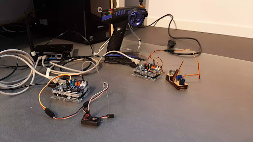

# Project-56
Aquabots: modelvaartuig bedieningssystemen

bestanden structuur:
    - Code
    - Documenten
    	- Functionele decompositie
        - aantekening PO meetings
        - Onderzoeken
        - Productbacklog

## Platform IO
https://platformio.org/

## Arduino IDE
https://www.arduino.cc/en/software
